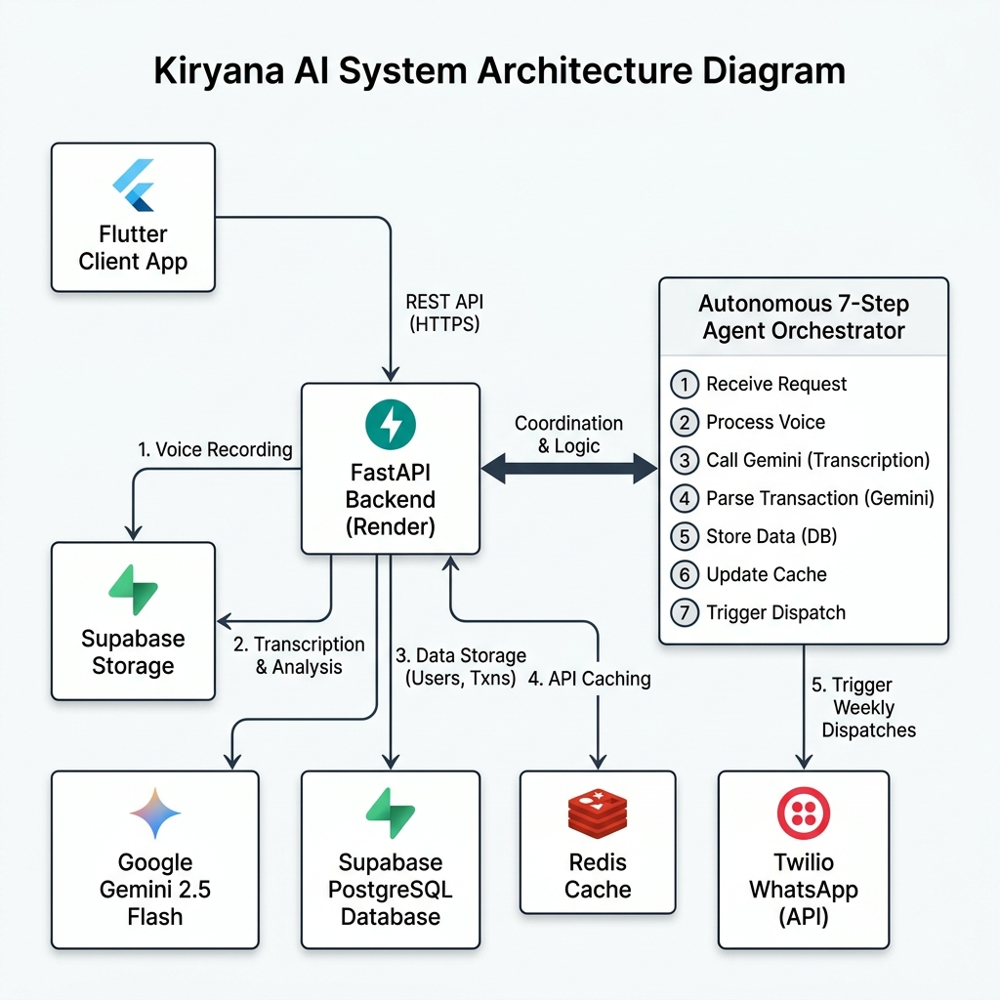

# Kiryana AI — AI-Powered Expense Manager for Pakistani Dukandaars

**Kiryana AI** is a voice-first, highly localized transaction ledger and business advisor built for small neighborhood grocery shopkeepers (*dukandaars*) and street vendors in Pakistan. 

Instead of typing numbers and product names into complex spreadsheets, a vendor speaks naturally in a mix of Urdu, Roman Urdu, or English (e.g., *"Do kilo ghee becha chhay sau ka"*). Kiryana AI transcribes and parses the audio, commits the structured transaction to a relational database, applies heuristic and AI-powered analytical models over their history, and dispatches weekly insights and actions directly through WhatsApp.

---

## Systems Architecture Diagram

Kiryana AI uses a modular, cloud-native architecture designed for rapid scaling, high resilience, and offline-graceful degradation.



---

## Database Schemas

All schemas are implemented via async SQLAlchemy in Supabase PostgreSQL:

### 1. `users` Table
* Manages dukandaar accounts and configurations.
* **Fields:**
  * `id` (`Integer`, Primary Key)
  * `phone_number` (`String(20)`, Unique, Nullable=False) — Pakistani format (e.g. `+923001234567`)
  * `name` (`String(100)`, Default=`Dukandaar`)
  * `language` (`String(5)`, Default=`ur`) — App locale standard
  * `notification_day` (`String(10)`, Default=`Sunday`) — WhatsApp digest day
  * `notification_time` (`String(5)`, Default=`10:00`) — WhatsApp digest time
  * `notifications_enabled` (`Boolean`, Default=`True`)
  * `created_at` (`DateTime`, Default=current timestamp)

### 2. `transactions` Table
* Logs every voice or manual financial transaction.
* **Fields:**
  * `id` (`Integer`, Primary Key)
  * `user_id` (`ForeignKey("users.id")`, Index=True, Nullable=False)
  * `item_name` (`String(200)`, Nullable=False) — Product label
  * `quantity` (`Float`, Nullable=True) — Decimal values (e.g., `1.5`)
  * `unit` (`String(20)`, Nullable=True) — E.g., `kg`, `litre`, `dozen`, `piece`
  * `amount` (`Float`, Nullable=False) — Value in PKR
  * `transaction_type` (`String(10)`, Nullable=False) — Must be `sale` or `expense`
  * `raw_text` (`Text`, Nullable=True) — Source transcript from speech
  * `audio_url` (`String(500)`, Nullable=True) — Link to audio file in Supabase Storage
  * `date` (`Date`, Index=True, Nullable=False) — Date transaction belongs to
  * `created_at` (`DateTime`, Default=current timestamp)

### 3. `insights` Table
* Stores weekly agent analytical outputs.
* **Fields:**
  * `id` (`Integer`, Primary Key)
  * `user_id` (`ForeignKey("users.id")`, Index=True, Nullable=False)
  * `session_id` (`String(100)`, Nullable=False) — Tracing token
  * `week_start` (`Date`, Nullable=False)
  * `week_end` (`Date`, Nullable=False)
  * `total_sales` (`Float`, Default=0)
  * `total_expenses` (`Float`, Default=0)
  * `profit` (`Float`, Default=0)
  * `top_items` (`Text`) — JSON array of top selling products
  * `recommendations` (`Text`) — JSON array of adapted recommendations
  * `key_insight` (`Text`) — Business observation in Roman Urdu
  * `report_text` (`Text`) — Compiled WhatsApp message body
  * `created_at` (`DateTime`, Default=current timestamp)

### 4. `agent_traces` Table
* Captures the step-by-step logs of the 7-step analytical pipeline.
* **Fields:**
  * `id` (`Integer`, Primary Key)
  * `user_id` (`ForeignKey("users.id")`, Index=True, Nullable=False)
  * `session_id` (`String(100)`, Index=True, Nullable=False)
  * `step_number` (`Integer`, Nullable=False) — `1` to `7`
  * `step_label` (`String(200)`, Nullable=False) — E.g., `Pattern Recognition`
  * `step_detail` (`Text`) — Detail, warnings, or fallback events
  * `status` (`String(20)`, Default=`success`) — E.g., `success`, `fallback_used`
  * `created_at` (`DateTime`, Default=current timestamp)

### 5. `voice_feedback` Table
* Captures user-submitted accuracy feedback for speech transcription.
* **Fields:**
  * `id` (`Integer`, Primary Key)
  * `user_id` (`ForeignKey("users.id")`, Index=True, Nullable=False)
  * `source_transaction_id` (`ForeignKey("transactions.id")`, Nullable=True)
  * `session_id` (`String(100)`, Nullable=True)
  * `raw_transcript` (`Text`)
  * `parsed_payload` (`Text`) — Initial JSON extract
  * `corrected_payload` (`Text`) — User corrected JSON
  * `is_correct` (`Boolean`, Default=False)
  * `created_at` (`DateTime`, Default=current timestamp)

### 6. `recommendation_feedback` Table
* Powers our reinforcement learning layer to weight future business advice.
* **Fields:**
  * `id` (`Integer`, Primary Key)
  * `user_id` (`ForeignKey("users.id")`, Index=True, Nullable=False)
  * `insight_id` (`ForeignKey("insights.id")`, Index=True, Nullable=False)
  * `session_id` (`String(100)`, Index=True, Nullable=False)
  * `recommendation_text` (`Text`, Nullable=False)
  * `accepted` (`Boolean`, Default=False)
  * `created_at` (`DateTime`, Default=current timestamp)

---

## API Route and Endpoint Registry

All backend routes are documented in Swagger UI and live under the following namespaces:

### Users Router (`backend/routes/users.py`)
* `POST /users/` — Idempotently creates or returns a user profile based on phone number.
* `GET /users/{user_id}` — Returns a user's language, notifications, and onboarding data.
* `PUT /users/{user_id}` — Updates name, notification times, or active language.

### Transactions Router (`backend/routes/transactions.py`)
* `POST /transactions/` — Manually saves or overrides a transaction in PostgreSQL.
* `GET /transactions/{user_id}` — Fetches transactions filtered by parameters (`today`, `week`, `month`).
* `GET /transactions/{user_id}/summary` — Returns today's sales, expenses, and net balances.
* `GET /transactions/{user_id}/recent` — Returns the last 3 logged transactions.
* `DELETE /transactions/{transaction_id}` — Deletes a transaction, invalidating cached entries.

### Voice Router (`backend/routes/voice.py`)
* `POST /voice/transcribe` — Multipart upload to write audio to storage, returns raw text.
* `POST /voice/ask` — Processes natural audio questions, returning context-aware shop tips.
* `POST /voice/process` — E2E multipart endpoint: transcribes, parses, and resolves date references.
* `POST /voice/parse` — Takes raw strings and parses them into standardized financial JSON payloads.

### Insights Router (`backend/routes/insights.py`)
* `POST /insights/generate/{user_id}` — Executes the **7-Step Antigravity Agent Workflow**.
* `GET /insights/{user_id}/latest` — Returns cached or freshly resolved weekly insights.
* `GET /insights/{user_id}/sessions` — Returns a list of past generated weekly insight sessions.
* `GET /insights/{user_id}/trace` — Retrieves the step timeline for the latest workflow run.
* `GET /insights/{user_id}/trace/{session_id}` — Retrieves step details for a specific session.
* `POST /insights/feedback/voice` — Submits correctness feedback for voice parsing.
* `POST /insights/feedback/recommendation` — Submits acceptance/rejection of business tips.
* `GET /insights/{user_id}/kpis` — Retrieves parser accuracy and recommendation acceptance KPIs.
* `POST /insights/{user_id}/ask` — Processes text-based business questions regarding store balances.
* `POST /insights/{user_id}/learning/refine` — Re-runs agent learning pathways to adjust weights.
* `POST /insights/{user_id}/learning/clear` — Clears historical feedback models for debugging.

### Notifications Router (`backend/routes/notifications.py`)
* `POST /notifications/whatsapp/{user_id}` — Triggers Twilio dispatch of compiled weekly summaries.
* `GET /notifications/settings/{user_id}` — Fetches active notification states.
* `PUT /notifications/settings/{user_id}` — Configures delivery days, times, and toggles.

---

## The Antigravity Role: 7-Step Autonomous Workflow

Kiryana AI implements Google's Challenge 1 agentic requirements by running an explicit 7-step orchestrator inside `backend/services/antigravity_agent.py`:

```text
Voice Input ➔ Parse ➔ Save ➔ [Antigravity Run Loop] ➔ WhatsApp Action
```

1. **Data Collection:** Gathers a week's transactions from PostgreSQL, validating inputs.
2. **Pattern Recognition:** Runs our branch heuristics engine to compute averages and high-revenue trends.
3. **Anomaly Detection:** Directs Gemini to scan recent history for atypical sales spikes or wholesale expenditures.
4. **Insight Generation:** Uses Gemini to synthesize anomalies and totals into Roman Urdu business tips.
5. **Action Planning:** Adapts weights by matching ideas against historical user feedback.
6. **Report Compilation:** Compiles high-impact, rich Urdu scripts.
7. **Execution Complete:** Saves the insight models, updates cache layers, and logs the complete transaction trace.

---

## Setup and Deployment Instructions

### 1. Backend Setup (Render & Local)
```powershell
cd backend
python -m venv .venv
.venv\Scripts\activate
pip install -r requirements.txt
copy .env.example .env
```
Update `backend/.env` with your API keys:
* `DATABASE_URL` (Supabase Postgres pooling URL)
* `REDIS_URL` (Redis server URL)
* `GEMINI_API_KEY` (Google Generative AI key)
* `SUPABASE_URL` and `SUPABASE_SERVICE_KEY`

**Database Migrations & Seeding:**
```powershell
alembic -c alembic.ini upgrade head
python seed.py
```

**Running Backend Server:**
```powershell
uvicorn main:app --reload
```

**Celery Worker Execution:**
```powershell
celery -A celery_app worker --loglevel=info
celery -A celery_app beat --loglevel=info
```

### 2. Frontend Flutter Web Setup
Build the responsive client locally:
```powershell
.\scripts\build_web.ps1 -ApiUrl "https://kiryana-ai-api.onrender.com"
```
Output build assets are written to `kiryana-ai-frontend\build\web`.

### 3. Netlify Deployment
1. Open [Netlify Drop](https://app.netlify.com/drop) and drag the output `build\web` folder onto the page.
2. Use the generated URL (e.g. `https://kiryana-ai.netlify.app`) on your mobile browser.

---

## Operational Assumptions and Sandbox Demo Mode

* **Demo Override Mode:** Set `TEST_MODE=true` in `backend/.env` to run end-to-end tests without incurring Gemini or Twilio API costs.
* **Pakistani Phone Formats:** The backend expects phone numbers normalized in E.164 Pakistani format (e.g. `+923001234567`).
* **Weekly Calendar Limit:** Business insight generation follows calendar weeks, running from Monday morning to Sunday night.
* **WhatsApp Twilio Sandbox:** For testing, users must opt-in by sending a manual join code to the Twilio gateway prior to automated dispatches.

---

## Privacy and Safety Notes

* **Audio Security:** Audio recordings are stored in a private Supabase Storage bucket, accessible only via signed URLs.
* **PII Sanitization:** The logging and trace systems do not record user names, full phone numbers, or credit notes. System traces (`agent_traces` table) store only numeric IDs.
* **Credential Safety:** The `.env` template is strictly gitignored, and all local GCP service account files are blocked from repository commits.

---

## Cost, Latency and Scalability (10x / 100x)

* **Voice Transcription & Parsing:** Resolves in **1.5s–3s** under Gemini 2.5 Flash, costing ~$0.0001 per audio log.
* **Weekly Insight Generation:** Resolves in **2s–3.5s**, costing ~$0.0003 per run.
* **Render Cold Start Latency:** Free Render hosting sleeps after 15 mins of idle time. The first request takes **30–60 seconds** to wake the service.
* **10x/100x Scaling Strategy:**
  * **FastAPI Horizontal Scaling:** Scaled horizontally with Gunicorn/Uvicorn process managers.
  * **Redis Cache Layer:** Dashboard summaries and profiles are cached for **600 seconds** to avoid hitting database pools on every load.
  * **Celery Background Workers:** Insight loops and WhatsApp notifications run in background thread workers, maintaining a non-blocking main API.

---

## Baseline Comparison: Heuristic vs. Agentic Kiryana AI

| Feature Area | Standard Heuristic Baseline | Agentic Kiryana AI (Our Engine) |
| :--- | :--- | :--- |
| **Input Parsing** | Brittle regex and manual input fields. | Multimodal speech-to-action parsing (resolving date context). |
| **Weekly Summaries** | Simple sums and static product tallies. | Dynamically structures data and targets anomalies. |
| **Recommendations** | Hardcoded generic templates. | Self-adapting advice shaped by user feedback. |
| **Operational Uptime** | API failures throw 500 error crashes. | Dual-layer fallback (Gemini 429 catches and Redis memory bypass). |
| **Operational Auditing** | Hidden backend processes. | A fully audible timeline log of agent steps. |

---

## Known Limitations

1. **Free Render Sleeper:** Production backend on Render sleeps if left idle, introducing a 30s cold start.
2. **Netlify Redirect Route:** Refreshing deep routes in static hosting yields a 404 unless a custom `netlify.toml` file is in place.
3. **Android APK SDK Prerequisites:** Compiling native APK files requires a configured Android SDK and signed Keystores.
4. **Urdu TTS Discarded:** Removed text-to-speech rendering pipelines to avoid adding 6 seconds of voice latency on local networks.

---

## Documentation Logs

To verify our complete implementation of Challenge 1, please review the files in the **`/antigravity/`** directory:
* **[README.md](./antigravity/README.md)** — Entrypoint index.
* **[workplan.md](./antigravity/workplan.md)** — Project strategic targets.
* **[task-plan.md](./antigravity/task-plan.md)** — Deliverable timeline and ownership.
* **[agent-observations.md](./antigravity/agent-observations.md)** — Multilingual transcription observations.
* **[reasoning-decisions.md](./antigravity/reasoning-decisions.md)** — Architectural design and copy logic.
* **[tool-calls.md](./antigravity/tool-calls.md)** — Tabular mapping of external API payloads.
* **[execution-log.md](./antigravity/execution-log.md)** — Real-world failure and recovery timelines.
* **[final-outcomes.md](./antigravity/final-outcomes.md)** — Performance KPIs and deployed URLs.
