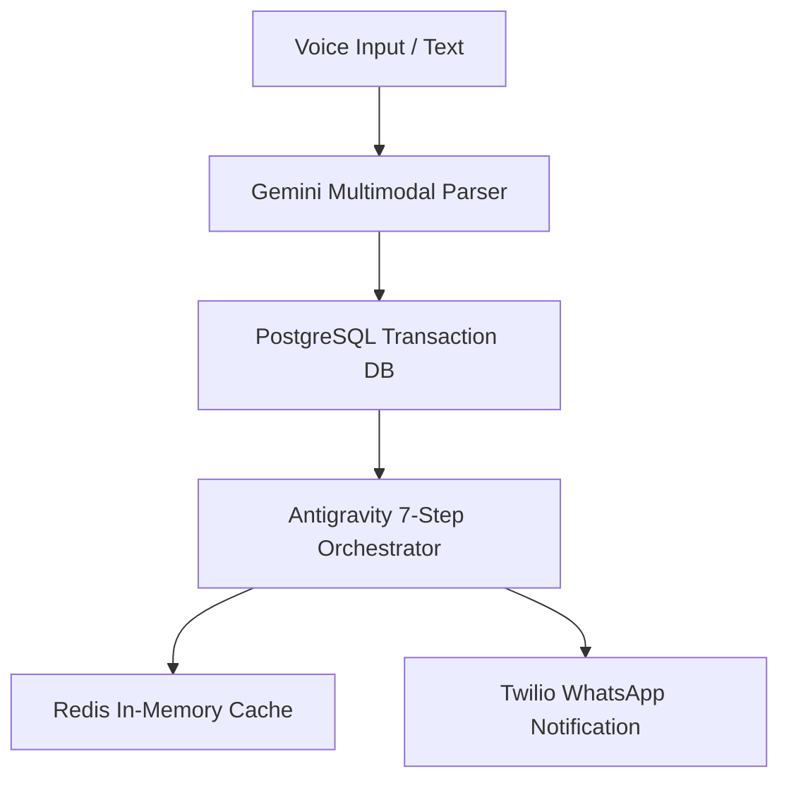

# Antigravity Submission Pack — Kiryana AI

Welcome to the **Antigravity Trace & Logs** submission package for **Google AISeekho 2026 Hackathon (Challenge 1: Autonomous Content-to-Action Agent)**.

This folder serves as a comprehensive, judge-ready archive demonstrating the engineering operations, reasoning traces, tool executions, and system actions that were managed under the **Antigravity** autonomous workflow engine. 

---

## 📂 Submission Index

Please explore the following trace logs to verify our implementation of the autonomous agent requirements:

1. **[workplan.md](./workplan.md)**
   * *Purpose:* Strategic goals, challenge scope, localized operational risks, and key success metrics for the Kiryana AI system.
2. **[task-plan.md](./task-plan.md)**
   * *Purpose:* Phased project timelines, step-by-step feature dependencies, and precise team ownership (Ahmad, Esha, Abdul, Usman).
3. **[agent-observations.md](./agent-observations.md)**
   * *Purpose:* Live observations captured at runtime, including shopkeeper audio patterns, multilingual speech logs, and business data trends.
4. **[reasoning-decisions.md](./reasoning-decisions.md)**
   * *Purpose:* Technical justifications for our models and prompt patterns, 7-step cognitive workflow, and regional usability choices.
5. **[tool-calls.md](./tool-calls.md)**
   * *Purpose:* An exhaustive tabular trace of every external API call, database query, and cache transaction executed by our agent core.
6. **[execution-log.md](./execution-log.md)**
   * *Purpose:* A step-by-step chronological run log showing the agent in action—complete with detailed **Vertex AI / Redis / Twilio failure and recovery simulations**.
7. **[final-outcomes.md](./final-outcomes.md)**
   * *Purpose:* Direct deployment links, system accuracy and latency KPIs, production readiness, and the vision for scaling to Pakistani markets.

---

## 🛠️ The Antigravity Core Orchestrator

Kiryana AI's analytical brain is driven by a custom 7-step agent workflow implemented in:
* `backend/services/antigravity_agent.py`

This orchestrator drives the **weekly insight pipeline** (`POST /insights/generate/{user_id}`): it consumes voice-logged transactions, runs seven traced analytical steps, and compiles Roman Urdu reports and recommendations. Voice capture (`POST /voice/process`) and **Get help from AI** (`POST /voice/ask`) use `ai_voice` + `gemini_service`; thumbs-up/down feedback feeds Step 5 adaptation via `recommendation_feedback` and `voice_feedback` tables.

See also **[../SUBMISSION.md](../SUBMISSION.md)** for the hackathon checklist and demo video links. 

Every action is fully logged to the `agent_traces` table in PostgreSQL, allowing the frontend UI to render a complete timeline of agent observations, reasoning pathways, and recovery overrides in real-time.
