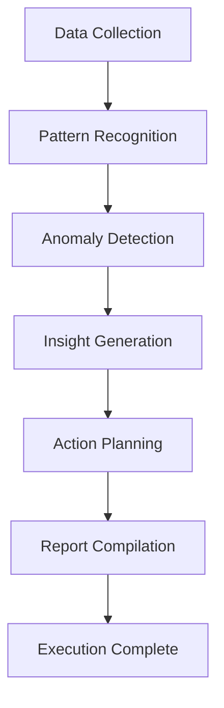

# Reasoning & Design Decisions — Kiryana AI

This document provides the core architectural and technical justifications for the decisions made during the design and construction of the Kiryana AI engine.

---

## 1. Why Gemini NLP vs. Rule-Based Regex for Voice Parsing

Traditional expense tracking software relies on strict form-filling or regex-based pattern matching (e.g., matching words like *"buy"* or *"sell"* followed by numbers). For a street vendor or kiryana owner in Pakistan, this approach fails consistently due to conversational flexibility:

* **Speech Variances:** A vendor might say *"sugar purchase ki Rs 500"* or *"paanch sau ki cheeni li"* or *"Rs 500 cheeni kharid li"*. Building regex patterns for all Urdu, Roman Urdu, and English permutations is mathematically complex and highly brittle.
* **Context Resolution:** Gemini 2.5 Flash understands conversational context. When a vendor says *"kal atta becha 400 ka aur aaj 450 ka"* (Yesterday sold flour for 400, today for 450), Gemini easily extracts **two separate transactions** and infers the correct transaction dates (`yesterday` and `today`). Regex is incapable of temporal inference.
* **Typo and Slang Tolerance:** Shopkeepers use diverse localized terms like *atta, cheeni, chawal, ghee, doodh, sabun*, alongside spelling variations like *khareeda, kharida, lea, liya*. Gemini maps these variations to standard English fields seamlessly, preserving local spellings only inside the `item_name` field.

---

## 2. Why a 7-Step Cognitive Workflow?

To build a reliable autonomous agent, we decomposed the weekly insight pipeline into 7 linear steps inside `antigravity_agent.py`. This structure mirrors a professional financial analyst's workflow:

* **Step 1: Data Collection** ensures the dataset is gathered from PostgreSQL and validated before LLM processing.
* **Step 2: Pattern Recognition** applies local heuristic calculations (calculating averages and high-revenue days) to supply hard factual numbers, preventing AI hallucinations.
* **Step 3: Anomaly Detection** uses LLM reasoning to scan raw transactional lists for unusual spikes or drops in cash flow.
* **Step 4: Insight Generation** takes the patterns and anomalies to generate business ideas.
* **Step 5: Action Planning** refines these ideas against user history, adjusting weights according to what tips the user previously accepted or rejected.
* **Step 6: Report Compilation** styles the text into high-impact Urdu copy with custom WhatsApp spacing.
* **Step 7: Execution Complete** updates caches and saves state, making the result verifiable.

---

## 3. Why a Dual-Layer Fallback Architecture?

Relying on expensive, cloud-hosted LLM endpoints introduces critical points of failure: API rate limits (Gemini 429 quota exhaustion), network latency, and Google Cloud project configurations. 

To make Kiryana AI **production-grade**, we designed a bulletproof fallback structure:

1. **Vertex AI Fail-Safe:** The agent attempts to initialize Vertex AI for Agent Builder pipelines. If the endpoint is unconfigured or a credentials error occurs, it catches the error and degrades instantly to a local **Gemini-only** execution, logging the fallback trace.
2. **Gemini 429 Fail-Safe:** If the Gemini API is blocked or depleted during weekly generation, the application does not crash. The `generate_insight` route in `insights.py` wraps `run_insight_workflow()` in try/except and calls `_fallback_insight()` on any exception, using `insight_engine.py` and `ai_insights` heuristics to return HTTP 200 with a fully calculated rule-based insight report. 
3. **Database Integrity:** Transactions are processed in async database transactions using SQLAlchemy, ensuring that a crash in the AI pipeline never affects or corrupts the primary financial records.

---

## 4. Why Roman Urdu for Communications?

A major user-experience barrier in South Asia is language accessibility:

* **Urdu Nastaliq Script:** While Urdu is the national language, reading Nastaliq script on small mobile screens is slow for shopkeepers who are busy handling customers.
* **Pure English:** Standard English terms like *"liquidity ratio"*, *"inventory turnover"*, or *"capital depreciation"* are incomprehensible to local micro-merchants.
* **The Sweet Spot — Roman Urdu:** Transliterating simple Urdu words using English characters (e.g., *"Aap ki dukaan ki bikri barh rahi hai"*) is the universal text standard used across SMS, WhatsApp, and social media in Pakistan. It is readable, familiar, and highly engaging for vendors.
