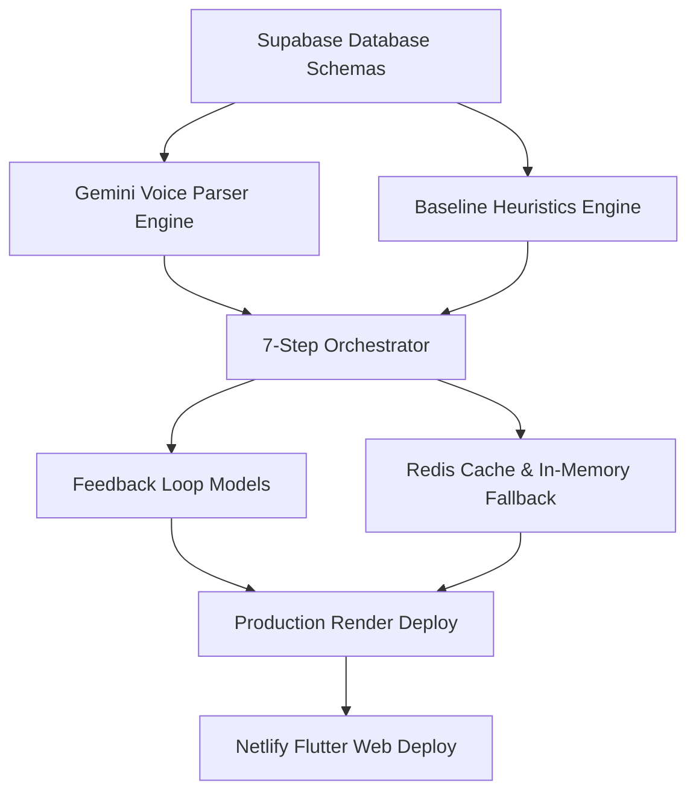

# Phased Project Task Plan — Kiryana AI

This document maps out our development phases, task dependencies, team roles, and actual milestone delivery dates leading to the **AISeekho 2026 Challenge 1** submission.

---

## 1. Team Roles & Module Ownership

To achieve high code-quality and modular isolation, the project was split into functional areas:

* **Esha Shabbir (AI Voice Lead):** 
  * Responsible for `/ai_voice/`. 
  * Authored the direct Gemini multimodal prompts and structured outputs (`schema.py` and `prompts.py`).
  * Built custom transcription handling designed to expect heavy street noise and Roman Urdu dialects.
* **Abdul Majeed (Business Logic Lead):** 
  * Responsible for `/ai_insights/`.
  * Designed local pattern recognition models (`patterns.py`), recommendation lookups (`recommender.py`), and heuristic text formatters (`report.py`).
* **Muhammad Usman (Frontend UI Lead):** 
  * Responsible for `kiryana-ai-frontend/`. 
  * Created the Flutter web & mobile pages, integrating voice recording widgets, real-time feedback forms, and the visual timeline for the Antigravity system logs.
* **Ahmad (Production Systems & Integration Lead):** 
  * Responsible for `backend/` and deployment infrastructure.
  * Designed PostgreSQL database schemas, relational tables, async connection setups, and the Redis cache service.
  * Created the main `antigravity_agent.py` orchestrator to unify Esha's voice extraction, Abdul's pattern rules, and Usman's user interfaces.

---

## 2. Phased Development Timeline

We executed this project across 4 core phases between March and May 2026:

### Phase 1: Core Voice & Parser Prototypes
* **Timeline:** March 15 – April 10, 2026
* **Tasks:**
  * Build isolated Python environments and test Gemini audio transcriptions (Esha).
  * Design standard SQL schemas for transactions and user tables in SQLAlchemy (Ahmad).
  * Implement baseline heuristic transaction calculations (Abdul).
* **Dependencies:** Supabase PostgreSQL setup completed first.

### Phase 2: Orchestration & Caching
* **Timeline:** April 11 – May 3, 2026
* **Tasks:**
  * Implement the 7-step run loop in `antigravity_agent.py` (Ahmad).
  * Develop the Redis Cache and memory fallbacks in `cache_service.py` to prevent redundant API queries (Ahmad).
  * Build the first iteration of the Flutter recording view (Usman).
* **Dependencies:** Phase 1 schemas and prompts must be fully stable.

### Phase 3: Feedback Loops & Fallbacks
* **Timeline:** May 4 – May 15, 2026
* **Tasks:**
  * Add Voice Feedback (`VoiceFeedback`) and Recommendation Feedback (`RecommendationFeedback`) routes and database models (Ahmad).
  * Implement the reinforcement heuristic to adapt weekly recommendations based on accepted/rejected history (Abdul & Ahmad).
  * Write the Twilio WhatsApp API service with sandbox mode configuration (Ahmad).
* **Dependencies:** Flutter frontend views for feedback loops.

### Phase 4: Production Deployment & Verification
* **Timeline:** May 16 – May 20, 2026
* **Tasks:**
  * Deploy the FastAPI backend on Render with PostgreSQL connection pools (Ahmad).
  * Deploy the Flutter app as a responsive web app on Netlify (Usman & Ahmad).
  * Perform chaos testing: simulate Redis outages, Twilio failures, and Gemini rate limits to verify fallbacks (All).
  * Compile the Antigravity submission package (Ahmad).

---

## 3. Dependency Graph

